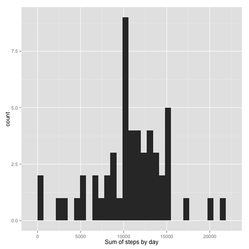
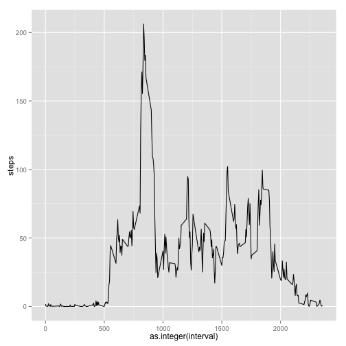
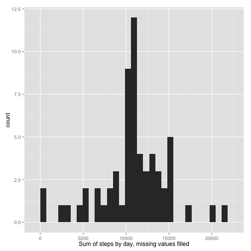
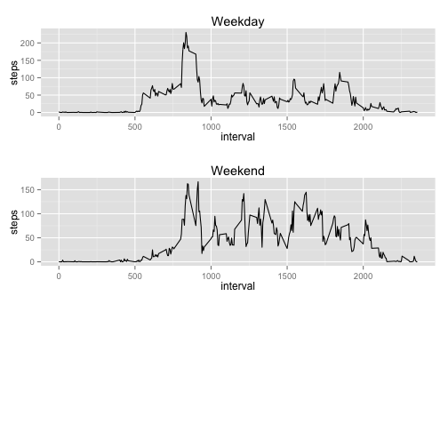

Personal Activity Monitoring Analysis: Reproducible Research Project 1
========================================================
# Reproducible Research: Peer Assessment 1

This is an analysis of data from personal activity monitoring devices. It is being
completed as project for the Reproducible Research course offered by Johns
Hopkins through Coursera.

## Loading and preprocessing the data
The source data is stored as a zip file at 
https://d396qusza40orc.cloudfront.net/repdata%2Fdata%2Factivity.zip

We will download the file to the "data" directory, unzip the file, and store the 
contained csv as a data frame.

```r
url <- "https://d396qusza40orc.cloudfront.net/repdata%2Fdata%2Factivity.zip"
download.file(url, "data/activity.zip", method = "curl")
unzip("data/activity.zip")
activity <- read.csv("activity.csv")
```

We need to transform the "date" field to be represented as a date for later in
the analysis.

```r
activity$date <- as.POSIXct(activity$date)
```

## What is the mean total number of steps taken per day?
For this part, we will ignore missing values, and reconsider them later.

To compute summary statistics based on total steps by day, let's create a data 
frame that contains the sum of all steps by day.

```r
sums <- aggregate(steps ~ date, data = activity, sum)
```

Now we'll generate a histogram of those sums. I prefer the aesthetics of ggplot2
, so we will load that library.

```r
library(ggplot2)
qplot(sums$steps) + xlab("Sum of steps by day")
```

```
## stat_bin: binwidth defaulted to range/30. Use 'binwidth = x' to adjust this.
```

 

Now let's find the mean and median of the sum of steps by day.

```r
dailymean <- mean(sums$steps)
meanDisplay <- format(round(dailymean,2), nsmall = 2)
dailymedian <- median(sums$steps)
```

The mean of total steps per day is 10766.19 and the median is 10765.

## What is the average daily activity pattern?
Let's see how steps vary over the time intervals by day.

```r
meansByInt <- aggregate(steps ~ interval, data = activity, mean)
ggplot(meansByInt, aes(as.integer(interval),steps)) + geom_line()
```

 

From the time series it appears that the maximum number of steps in a day occurs
around 800. Let's find the actual interval where the maximum occurs.

```r
maxsteps <- meansByInt[which.max(meansByInt$steps),2]
maxint <- meansByInt[which.max(meansByInt$steps),1]
```
The 5-minute interval that contains the max number of steps on average across 
all days in the data set is 835 and the value is 206.1698.

## Imputing missing values
Let's find the total number of missing values.

```r
missingvalues <-sum(is.na(activity$steps))
```
The total number of missing values is 2304.

Now we will create a new data frame and replace missing values with the mean for
the interval in which the variable is missing.

```r
activityFilled <- activity
for (i in 1:length(activity$steps)) {
        if (is.na(activity$steps[i])) {
                activityFilled$steps[i] <- meansByInt[meansByInt$interval == activity[i,3],2]
        }
}
```

Let's look at a histogram and the mean and medianof the new data frame to 
compare how replacing missing variables affected our results.

```r
sumsFilled <- aggregate(steps ~ date, data = activityFilled, sum)
library(ggplot2)
qplot(sumsFilled$steps) + xlab("Sum of steps by day, missing values filled")
```

```
## stat_bin: binwidth defaulted to range/30. Use 'binwidth = x' to adjust this.
```

 

```r
dailymeanFilled <- mean(sumsFilled$steps)
meanFilledDisplay <- format(round(dailymeanFilled,2), nsmall=2)
dailymedianFilled <- median(sumsFilled$steps)
medianFilledDisplay <- format(round(dailymedianFilled,2), nsmall=2)
```
After filling the missing values, the new daily mean is 10766.19, 
compared to the original mean of 10766.19, and the new daily median is
10766.19 compared to the original daily median of 10765.

## Are there differences in activity patterns between weekdays and weekends?
We'll create a new variable in the dataframe that is a vector indicating whether 
the measurement is on a weekday or weekend.

```r
weekday <- c("Monday","Tuesday","Wednesday","Thursday","Friday")
weekend <- c("Saturday", "Sunday")
for (i in 1:length(activityFilled$date)) {
        if (weekdays(activityFilled$date[i]) %in% weekday) {
                activityFilled$dayofweek[i] <- "weekday"
        }
        else { 
                activityFilled$dayofweek[i] <- "weekend"
        }
}
activityFilled$dayofweek <- as.factor(activityFilled$dayofweek)
```

Then we'll calculate the means for each interval and display.

```r
##Calculate means for weekdays and weekends
meansByIntFilledDay <- aggregate(steps ~ interval, data = activityFilled[activityFilled$dayofweek == "weekday",], mean)
meansByIntFilledEnd <- aggregate(steps ~ interval, data = activityFilled[activityFilled$dayofweek == "weekend",], mean)

## Create a ggplot2 for each set of means
dayplot <- ggplot(meansByIntFilledDay, aes(as.integer(interval),steps)) + geom_line() + ggtitle("Weekday") + xlab("interval")
endplot <- ggplot(meansByIntFilledEnd, aes(as.integer(interval),steps)) + geom_line() + ggtitle("Weekend") + xlab("interval")

## Add the multiplot funciton to add both plots to the same device
library(grid)
# Multiple plot function (from cookbook-r.com)
#
# ggplot objects can be passed in ..., or to plotlist (as a list of ggplot objects)
# - cols:   Number of columns in layout
# - layout: A matrix specifying the layout. If present, 'cols' is ignored.
#
# If the layout is something like matrix(c(1,2,3,3), nrow=2, byrow=TRUE),
# then plot 1 will go in the upper left, 2 will go in the upper right, and
# 3 will go all the way across the bottom.
#
multiplot <- function(..., plotlist=NULL, file, cols=1, layout=NULL) {
  require(grid)

  # Make a list from the ... arguments and plotlist
  plots <- c(list(...), plotlist)

  numPlots = length(plots)

  # If layout is NULL, then use 'cols' to determine layout
  if (is.null(layout)) {
    # Make the panel
    # ncol: Number of columns of plots
    # nrow: Number of rows needed, calculated from # of cols
    layout <- matrix(seq(1, cols * ceiling(numPlots/cols)),
                    ncol = cols, nrow = ceiling(numPlots/cols))
  }

 if (numPlots==1) {
    print(plots[[1]])

  } else {
    # Set up the page
    grid.newpage()
    pushViewport(viewport(layout = grid.layout(nrow(layout), ncol(layout))))

    # Make each plot, in the correct location
    for (i in 1:numPlots) {
      # Get the i,j matrix positions of the regions that contain this subplot
      matchidx <- as.data.frame(which(layout == i, arr.ind = TRUE))

      print(plots[[i]], vp = viewport(layout.pos.row = matchidx$row,
                                      layout.pos.col = matchidx$col))
    }
  }
}
## print the plots
multiplot(dayplot,endplot,col=1)
```

 

```
## [1] 1
```
